  

  
  
  
  

---

### 👋 About

Full Stack & iOS developer with a Computer Engineering degree (Beykent University, 2025). I focus on **performance-critical** and **security-first** products — from on-device machine learning and Swift 6 concurrency to end-to-end encrypted communication and scalable web backends.

- 🧠 On-device ML (TF-IDF / Logistic Regression, ~95% accuracy) and applied neural networks (Keras)
- 🔐 End-to-end encryption with Curve25519 + AES-GCM 256-bit (sub-50ms latency)
- 📱 Native iOS & macOS with Swift 6 Concurrency (Actors), SwiftUI, Combine, MapKit, CryptoKit
- 🌐 Full stack web — PHP/Laravel, MySQL, JavaScript, AWS (Lambda, DynamoDB), REST APIs

---

### 📦 Featured Repositories

  

| Repository | What it is | Stack |
|---|---|---|
| **[PureGlass](https://github.com/GRJY/PureGlass)** ⭐ | Native Liquid Glass Mac cleaner & system monitor for macOS 26 — free, private, fully offline | Swift 6 · SwiftUI |
| **[codemaster](https://github.com/GRJY/codemaster)** | Code review & improvement-suggestion system | JavaScript |
| **[Prediction-Of-Customer-Purchases-ANN](https://github.com/GRJY/Prediction-Of-Customer-Purchases-ANN)** | Purchase-intent ANN — 80.5% accuracy, 0.81 AUC-ROC on 550K rows | Python · Keras |
| **[BookFy](https://github.com/GRJY/BookFy-Virtual-Library-Management-Application)** | Virtual library management platform (graduation project) | PHP · MySQL · jQuery |
| **[homebrew-tap](https://github.com/GRJY/homebrew-tap)** | Homebrew tap — `brew install --cask GRJY/tap/pureglass` | Ruby |

---

### 🚀 Startup & Product Work

| Project | Description | Stack |
|---|---|---|
| **TechPulse** | On-device ML news platform that filters global tech innovations & live streams, with context-preserving instant translation. | Swift 6 · SwiftUI · Python (ML) · Supabase |
| **Campers** | Safety-first camping platform with dynamic maps, offline sync, and E2EE emergency communication. | Swift · Combine · CryptoKit · Supabase · MapKit |
| **LiquidGlassKit** | Custom SwiftUI library — glassmorphism UI, advanced animations, and an SOS module. | Swift · SwiftUI |

---

### 🌐 Client & Freelance Web Work

Production websites I designed and built end-to-end:

| Site | Role |
|---|---|
| [businessturkiye.co](https://businessturkiye.co) | Designed & developed |
| [iremkalkanpromakeup.com](https://iremkalkanpromakeup.com) | Designed & developed |
| [kozmonet.com.tr](https://kozmonet.com.tr) | Designed & developed |
| [valego.com.tr](https://valego.com.tr) | Backend & infrastructure |

---

### 🛠️ Tech Stack

  
  
  
  
  
  
  
  

  
  
  
  
  
  

---

### 📜 Certifications

`Meta Full Stack Developer` · `IBM AI Engineering` · `AWS Cloud Practitioner` · `Google UX Design` · `PCEP — Python Institute` · `Oracle Java Foundations` · `GIAC Python Coder (GPYC)`

---

### 📊 GitHub

  <picture>
    <source media="(prefers-color-scheme: dark)" srcset="https://github-readme-stats.vercel.app/api?username=GRJY&show_icons=true&hide_border=true&count_private=true&theme=tokyonight&bg_color=0d1117&icon_color=8ea2ff&title_color=8ea2ff"/>
    
  </picture>
  <picture>
    <source media="(prefers-color-scheme: dark)" srcset="https://github-readme-stats.vercel.app/api/top-langs/?username=GRJY&layout=compact&hide_border=true&theme=tokyonight&bg_color=0d1117&title_color=8ea2ff"/>
    
  </picture>

  

